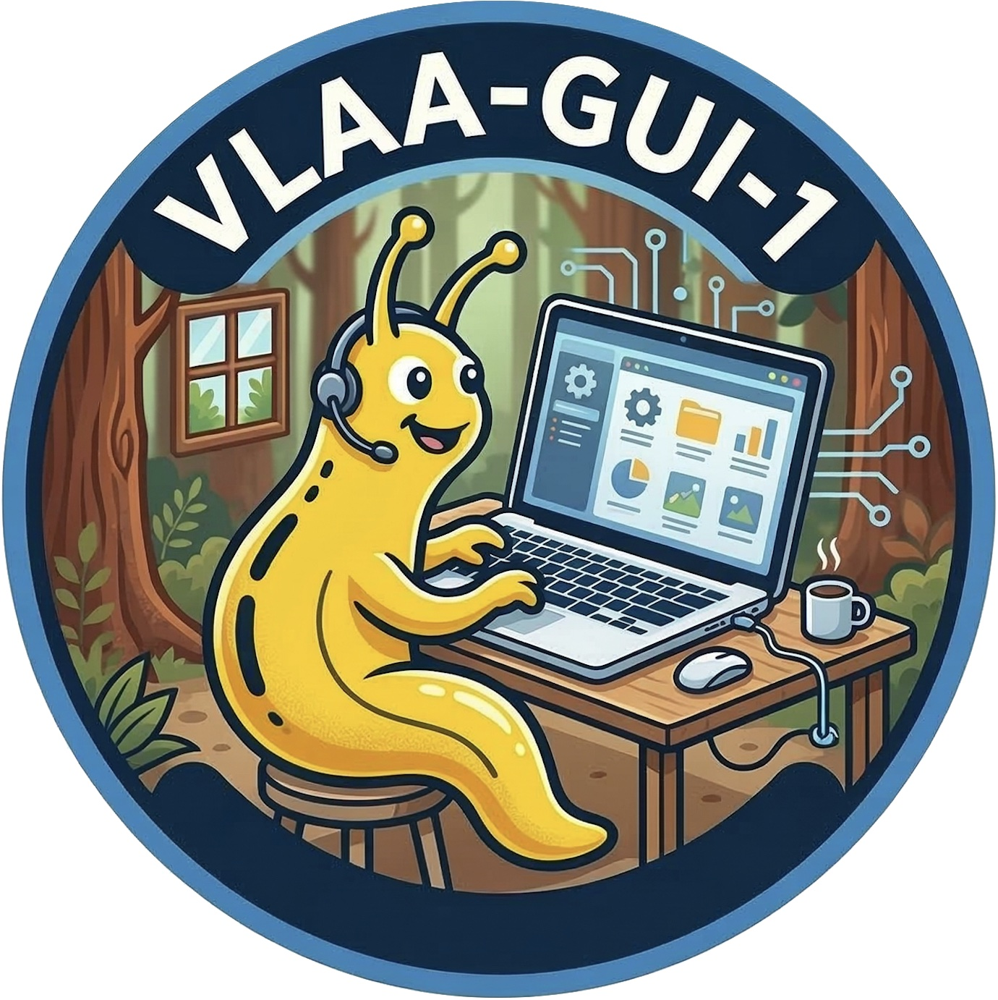
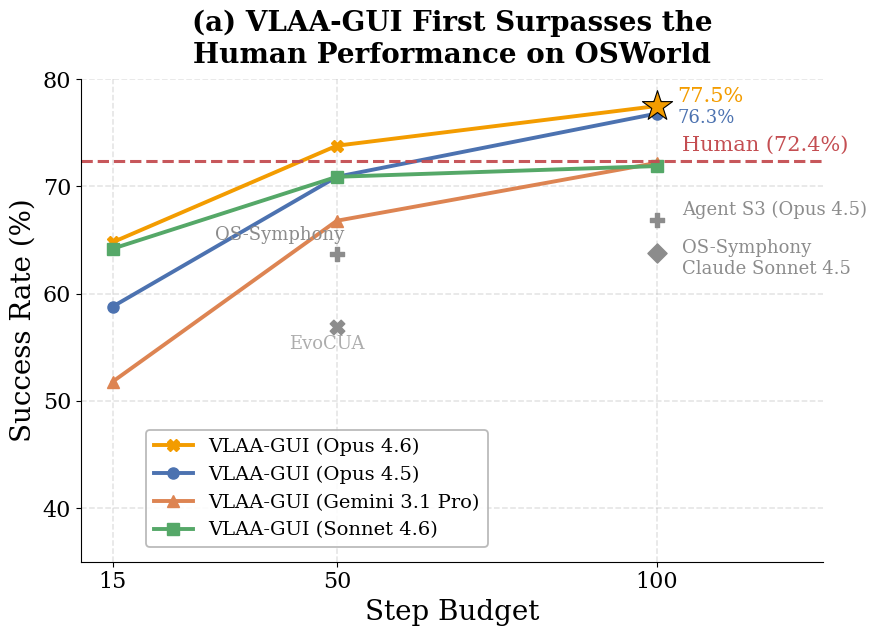
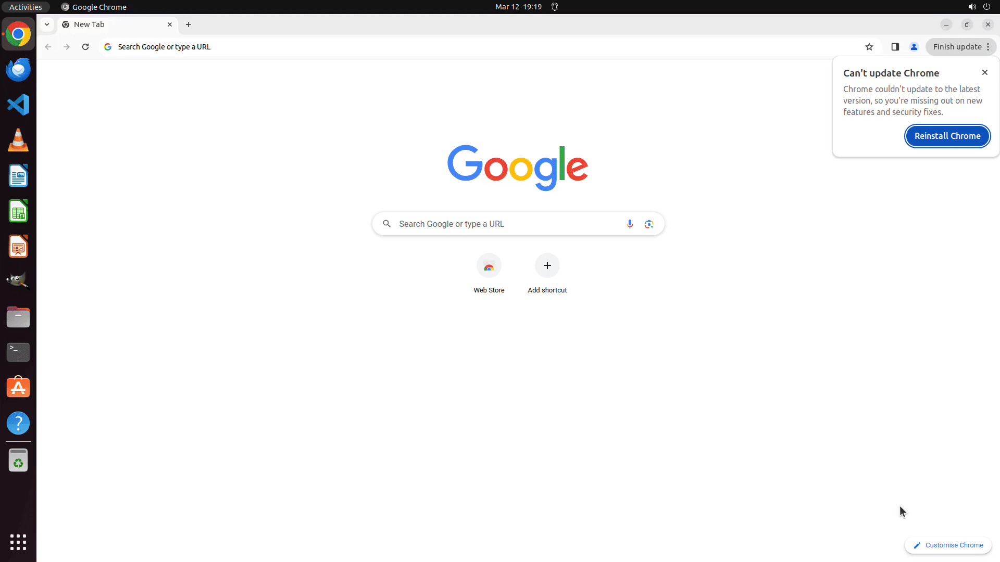
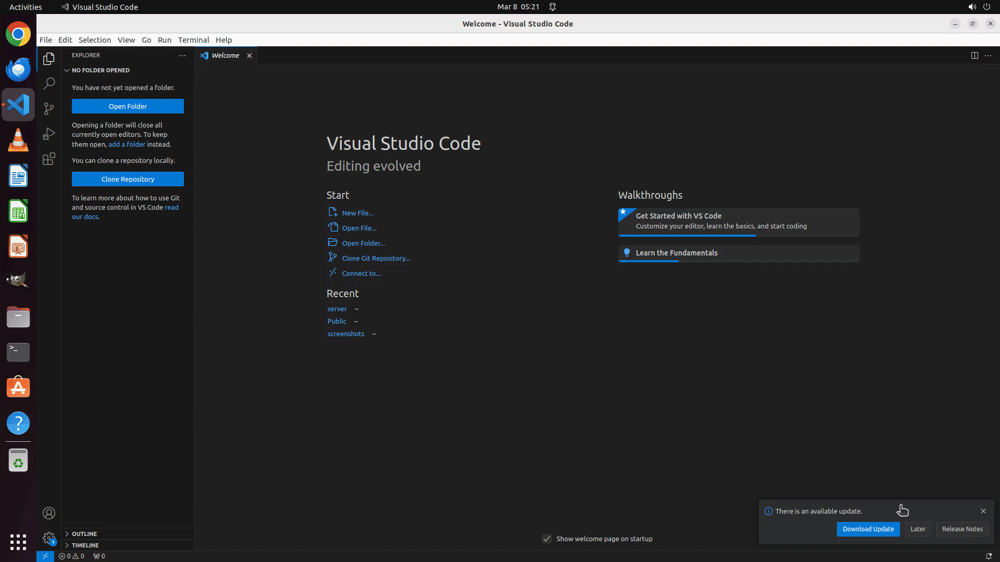
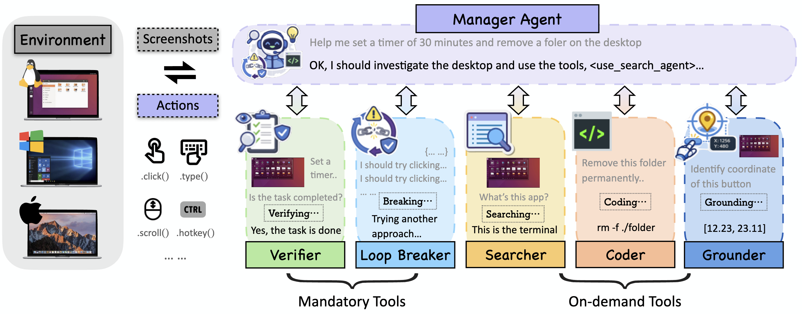
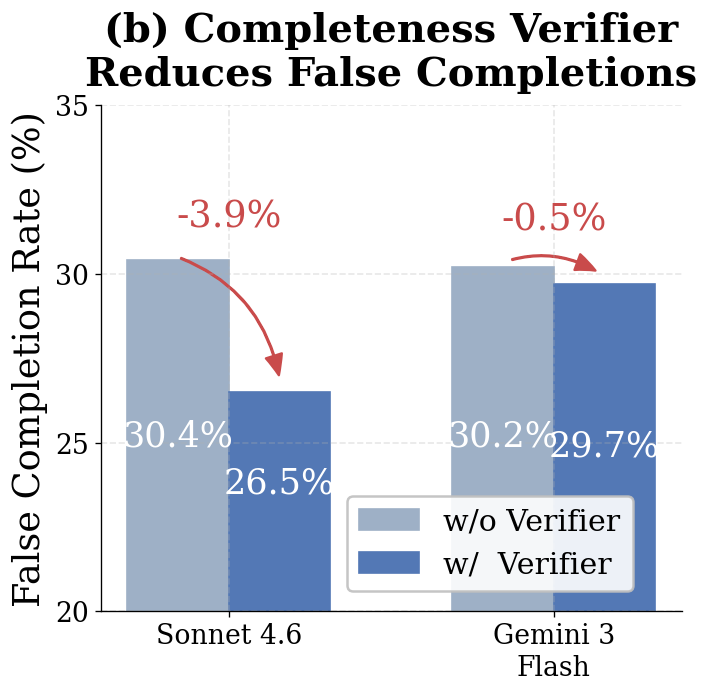
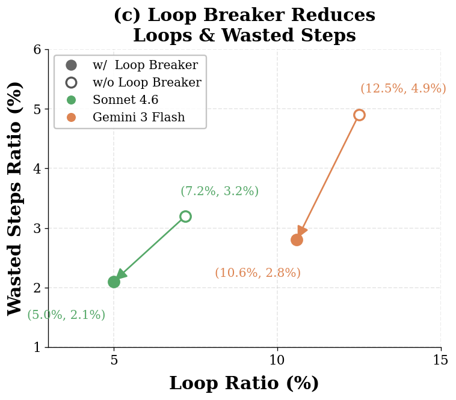

# VLAA-GUI

<p align="center">
  
</p>

<p align="center">
  <strong>Knowing When to <code>STOP</code>, <code>RECOVER</code>, and <code>SEARCH</code></strong><br>
  A Modular Framework for GUI Automation
</p>

<p align="center">
  <a href="https://arxiv.org/abs/2604.21375"></a>
  <a href="https://ucsc-vlaa.github.io/VLAA-GUI"></a>
  <a href="LICENSE"></a>
  
</p>

This repository accompanies our paper, **"[Knowing When to `STOP`, `RECOVER`, and `SEARCH`: A Modular Framework for GUI Automation](https://arxiv.org/abs/2604.21375)"**.

<p align="center">
  
</p>
## Highlights

- VLAA-GUI reaches **77.5%** on **OSWorld-Verified**.
- VLAA-GUI reaches **61.0%** on **WindowsAgentArena**.
- Three of five evaluated backbones surpass human performance on OSWorld in a single pass.
- With Sonnet 4.6, VLAA-GUI at **15 action steps** already exceeds the best published **50-step** system reported in the paper.

## Examples

<p align="center">
  
</p>

>  **Chrome · Startup Page Fix**

> “On my Surface Pro, whenever I launch Chrome it always opens ‘funbrain.com’. I don't want this. I cleared my cache but it still happens—can you fix it?”


<p align="center">
  
</p>

> **VS Code · Settings Modification**

>  “I want to make the tabs wrapped over multiple lines when exceeding available space, please help modify the setting of VS Code.”


## Method Overview

VLAA-GUI centers on a manager agent that interacts with the desktop in a perceive-reason-act loop. Two modules are applied as mandatory post-action checks: the **Completeness Verifier**, which rejects unsupported completion claims unless success is visible on the UI, and the **Loop Breaker**, which escalates recovery when the trajectory shows repeated failures or recurring screen states. Three additional tools are available on demand: a **Search Agent** for unfamiliar workflows, a **Coding Agent** for code-centric actions, and a **Grounding Agent** for precise action localization.

<p align="center">
  
</p>

## Failure Analysis

The paper studies two dominant GUI-agent failure modes: false completion and repetitive looping. The Completeness Verifier reduces unsupported termination, while the Loop Breaker cuts wasted action steps for loop-prone models.

<p align="center">
  
  
</p>

## Repository Structure

The main implementation lives under [`vlaa_gui/`](vlaa_gui):

- [`vlaa_gui/agents/`](vlaa_gui/agents): manager, worker, verifier, grounding, coding, and search agents.
- [`vlaa_gui/core/`](vlaa_gui/core): model/provider backends and shared runtime modules.
- [`vlaa_gui/memory/`](vlaa_gui/memory): procedural memory and prompting logic.
- [`vlaa_gui/utils/`](vlaa_gui/utils): local environment helpers, formatting, and token tracking.
- [`vlaa_gui/run_agent.py`](vlaa_gui/run_agent.py): local interactive entry point.

Supporting files:

- [`config/template.toml`](config/template.toml): configuration template.
- [`scripts/run_agent.sh`](scripts/run_agent.sh): AWS-oriented launcher script for local runs.
- [`osworld_setup/README.md`](osworld_setup/README.md): note for OSWorld-side integration.
- [`tests/`](tests): unit tests for platform behavior and CLI parsing.

## Installation

VLAA-GUI requires **Python 3.12+**. We recommend [`uv`](https://github.com/astral-sh/uv) for environment management.

```bash
git clone https://github.com/UCSC-VLAA/VLAA-GUI.git
cd VLAA-GUI
uv sync
```

## Configuration

Start from the provided template:

```bash
cp config/template.toml config/config.toml
```

Then fill in the sections you need for your setup:

- `[model]`: main manager model.
- `[grounding]`: grounding model or endpoint configuration.
- `[coding]`: model used by the optional coding agent.
- `[embedding]`: embedding backend.
- `[searcher]`: on-demand search agent backend.
- `[gate]`: completeness and loop-handling behavior.
- `[action_space]`: `pyautogui` or `pyautogui_coding`.

## Running VLAA-GUI Locally

The default local entry point is:

```bash
agent
```

Notes:

- On macOS, grant **Accessibility** and **Screen Recording** permissions to the terminal application you use.
- [`scripts/run_agent.sh`](scripts/run_agent.sh) expects AWS credentials and will exit early if they are not present.
- The `pyautogui_coding` action space enables local code execution and should only be used in trusted environments.
- Logs and token usage summaries are written under [`logs/`](logs).

## OSWorld Evaluation

This checkout includes a lightweight OSWorld handoff note in [`osworld_setup/README.md`](osworld_setup/README.md). The full benchmark-side integration instructions live in the OSWorld repository and should be followed from there.


## Citation

If you find this repository useful, please cite our arXiv preprint.

```bibtex
@misc{vlaagui2026,
  title={Knowing When to STOP, RECOVER, and SEARCH: A Modular Framework for GUI Automation},
  author={Qijun Han and Haoqin Tu and Zijun Wang and Haoyue Dai and Yiyang Zhou and Nancy Lau and Alvaro A. Cardenas and Yuhui Xu and Ran Xu and Caiming Xiong and Zeyu Zheng and Huaxiu Yao and Yuyin Zhou and Cihang Xie},
  year={2026},
  eprint={2604.21375},
  archivePrefix={arXiv},
  url={https://arxiv.org/abs/2604.21375}
}
```

## Acknowledgements

This project builds on the open-source [Agent-S](https://github.com/simular-ai/Agent-S) codebase and is closely connected to the broader GUI-agent ecosystem, including [OSWorld](https://github.com/xlang-ai/OSWorld) and [WindowsAgentArena](https://github.com/microsoft/WindowsAgentArena). We thank these communities for making large-scale evaluation and comparison possible.
